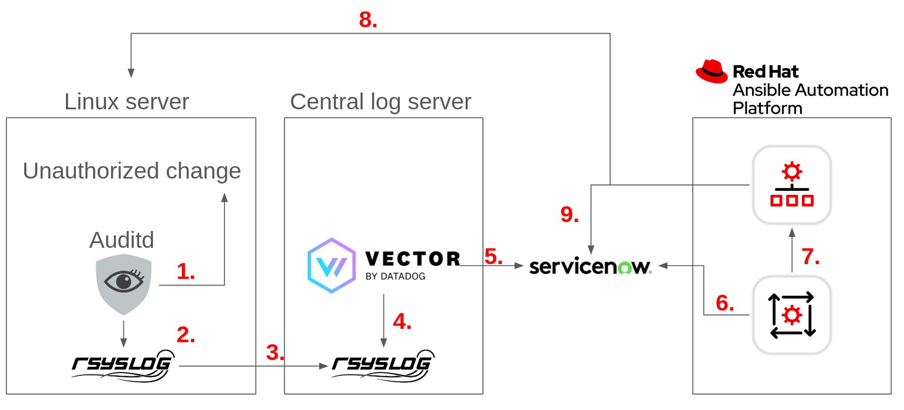

# Event Driven Ansible use-cases

Hello and welcome to this showcase of using Event Driven Ansible to remediate detected changes in a Linux security baseline.
This this repository shows how you can build a standardized automated IT operations, using two main blueprints:

* Event Driven Ansible + ServiceNow
* Event Driven Ansible + Kafka

For details, read below.

## Event Driven Ansible + Kafka

1. Auditd detects an unauthorized change and tags it as a violation to the security baseline.
2. Auditd provides information about what has happened to rsyslog
3. Rsyslog sends audit trail of what happened to a central log server.
4. Vector reads information from the central log server and processes the information.
5. Vector sends select information about the violation to a security-baseline topic on a central Kafka cluster.
6. AAP Event Driven Ansible (EDA) listens to the Kafka security-baseline topic and gets information that there has been a violation.
7. The EDA rulebook in question fires off an action (running a job template), which is to re-apply the security baseline on the server in question. EDA sends information such as what system was impacted and auditd log information to the template, allowing it to execute against the impacted system.
8. A job template run on the AAP Controller receives information remediates the authorized change by re-apply the security baseline.

## Event Driven Ansible + ServiceNow

1. Auditd detects an unauthorized change and tags it as a violation to the security baseline.
2. Auditd provides information about what has happened to rsyslog
3. Rsyslog sends audit trail of what happened to a central log server.
4. Vector reads information from the central log server and processes the information.
5. Vector sends select information about the violation to an incident queue in ServiceNow.
6. AAP Event Driven Ansible (EDA) polls for new incidents created in ServiceNow - and gets information that there has been a violation.
7. The EDA rulebook in question fires off an action (running a job template), which is to re-apply the security baseline on the server in question. EDA sends information such as what system was impacted and auditd log information to the template, allowing it to execute against the impacted system.
8. A job template run on the AAP Controller receives information remediates the authorized change by re-apply the security baseline - and updates ServiceNow / closes the incident.

## Installation
I've just set this up myself. I'll try to get to creating this environment automatically later.

- To setup a demo environment you need 3 servers + AAP 2.5:
1. A RHEL 9 system to protect
2. A RHEL 9 system to host rsyslog server and vector
3. If you use the Kafka integration pattern: A RHEL 9 system to host Kafka
4. If you use the ServiceNow integration pattern: ServiceNow instance
5. AAP 2.5 or later

### On the system you are looking to protect:
Put in place the audit.rules and rsyslog.conf configuration found in the audit/rsyslog folders.

### On the rsyslog/vector system:
Install and configure vector and rsyslog as described in the rsyslog/vector folders.

### If you use the Kafka integration pattern: On the Kafka system:
Install and configure Kafka as described in the kafka folder.

### If you use the ServiceNow integration pattern: In ServiceNow:
* Identify a standard incident you want to target.
* [Build a custom ServiceNow Decision Environment by following the instructions here.](https://github.com/mglantz/linux-security-baseline-eda/tree/main/custom-de)
* Upload the custom ServiceNow Decision Environment to AAP

### On AAP
Configure what's required following instructions in the aap folder.

## Author(s)
- Magnus Glantz, sudo@redhat.com, 2026

## Credits
- Many thanks to Mina George, Red Hat, who came up with the idea of using Vector and a normal Rsyslog server to feed into EDA actions. Without you Mina, I would have never set this up.
- Much thanks to Alexander Rydekull, Red Hat, who on a shared flight from LA to Copenhagen, co-authored the idea of using EDA to resolve capacity related issues in large scale security baseline implementation.

