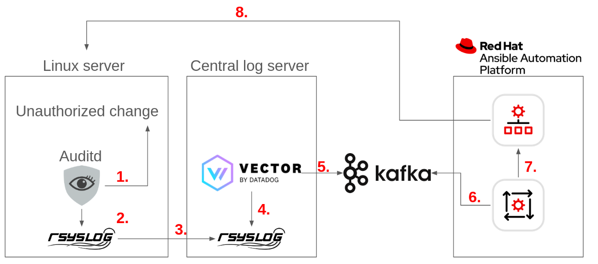

# linux-security-baseline-eda

Hello and welcome to this demonstration of using Event Driven Ansible to remediate detected changes in a Linux security baseline.

## Overview

1. Auditd detects an unauthorized change and tags it as a violation to the security baseline.
2. Auditd provides information about what has happened to rsyslog
3. Rsyslog sends audit trail of what happened to a central log server.
4. Vector reads information from the central log server and processes the information.
5. Vector sends select information about the violation to a security-baseline topic on a central Kafka cluster.
6. AAP Event Driven Ansible (EDA) listens to the Kafka security-baseline topic and gets information that there has been a violation.
7. The EDA rulebook in question fires off an action (running a job template), which is to re-apply the security baseline on the server in question. EDA sends information such as what system was impacted and auditd log information to the template, allowing it to execute against the impacted system.
8. A job_template run on the AAP Controller receives information remediates the authorized change by re-apply the security baseline.

## Installation
I've just set this up myself. I'll try to get to creating this environment automatically later.

- To setup a demo environment you need 3 servers + AAP 2.5:
1. A RHEL 9 system to protect
2. A RHEL 9 system to host rsyslog server and vector
3. A RHEL 9 system to host Kafka
4. AAP 2.5

### On the system you are looking to protect:
Put in place the audit.rules and rsyslog.conf configuration found in the audit/rsyslog folders.

### On the rsyslog/vector system:
Install and configure vector and rsyslog as described in the rsyslog/vector folders.

### On the Kafka system:
Install and configure Kafka as described in the kafka folder.

### On AAP 2.5
Configure what's required following instructions in the aap folder.

## Author(s)
- Magnus Glantz, sudo@redhat.com, 2025

## Credits
- Many thanks to Mina George, Red Hat, who came up with the idea of using Vector and a normal Rsyslog server to feed into EDA actions. Without you Mina, I would have never set this up.
- Much thanks to Alexander Rydekull, Red Hat, who on a shared flight from LA to Copenhagen, co-authored the idea of using EDA to resolve capacity related issues in large scale security baseline implementation.

